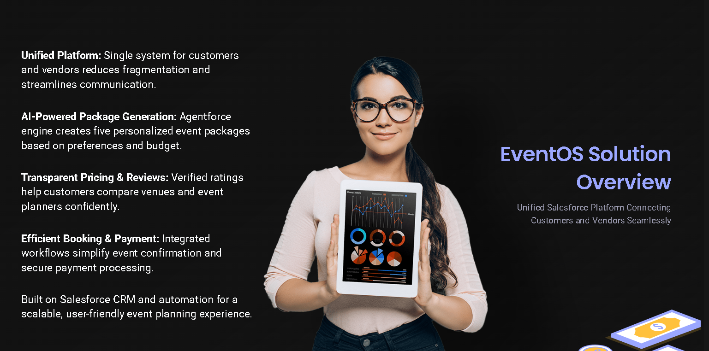
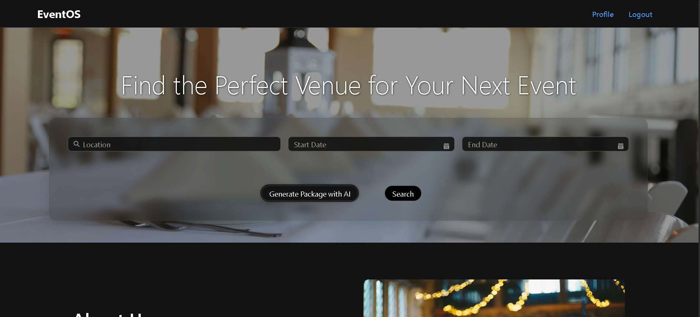
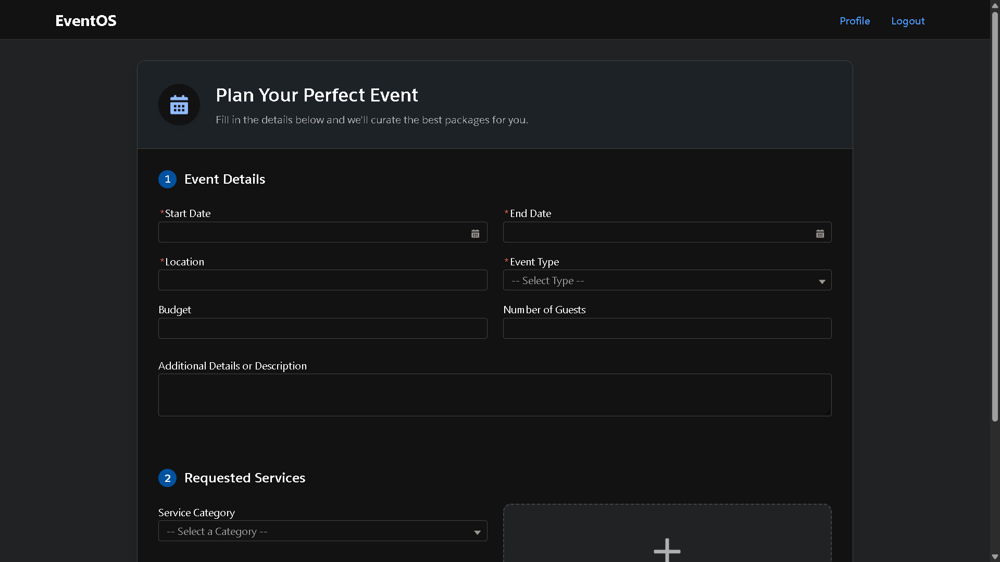
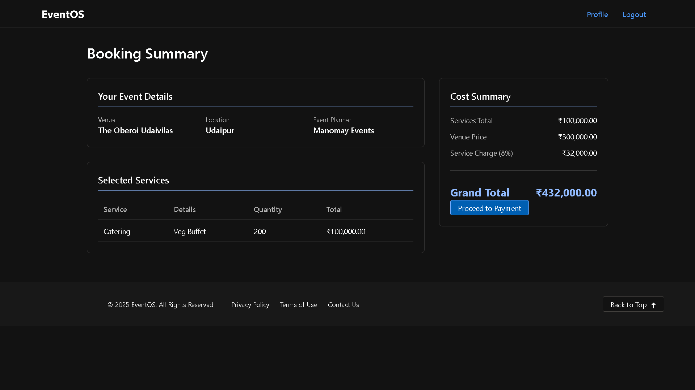
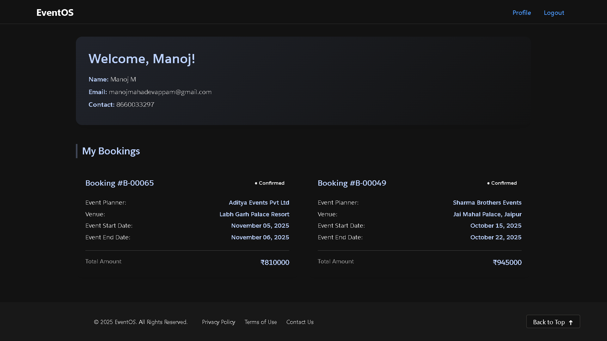
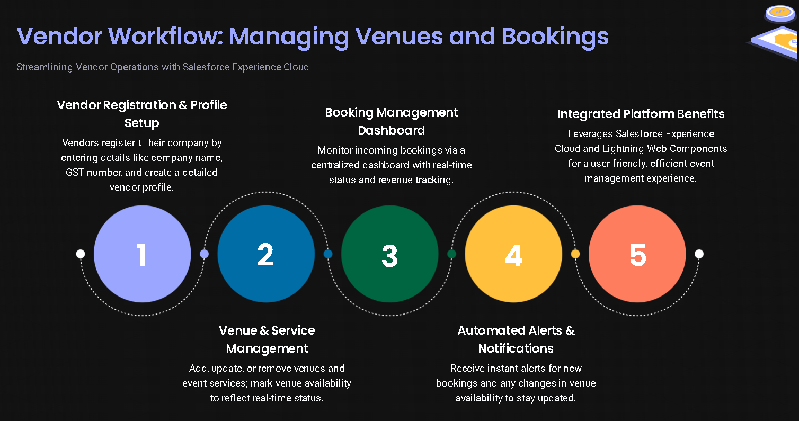
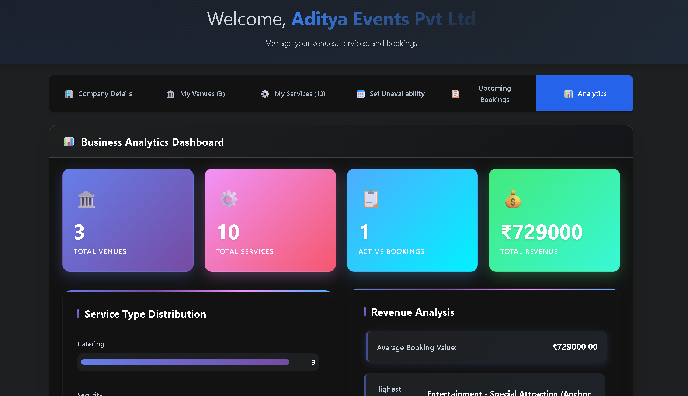
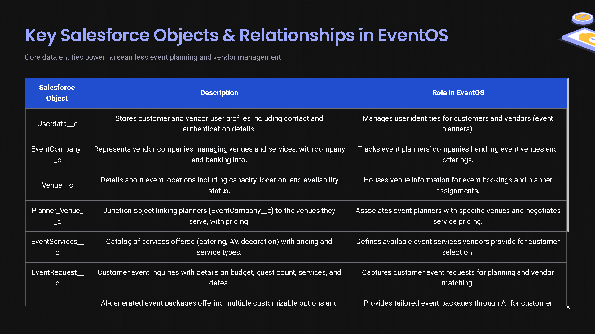
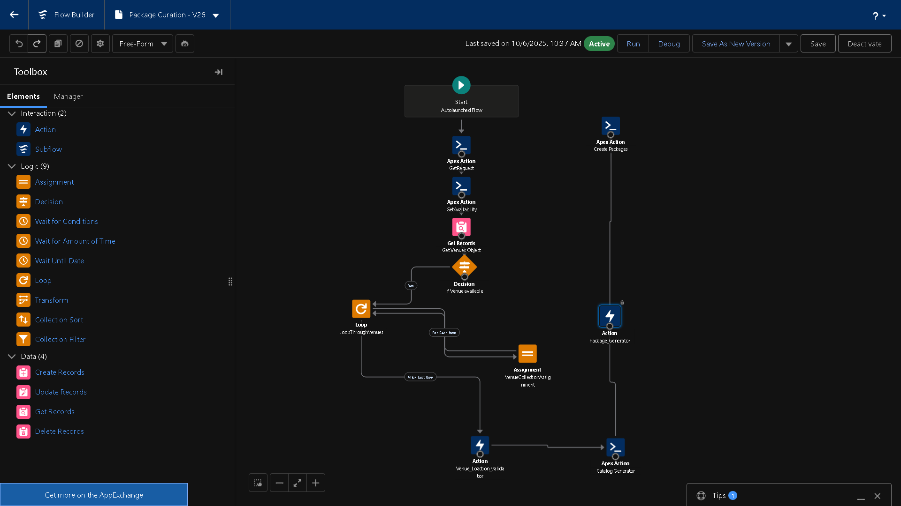

# EventManager — Salesforce Experience App

End-to-end platform for discovering venues, assembling services, and managing event bookings in Salesforce. The app serves two primary personas:

- Customer: browses venues, configures service packages, requests/places bookings, and tracks upcoming events.
- Vendor: sets up company details, manages venues and availability, reviews requests, and accepts bookings.

This repo is an SFDX project leveraging LWC (primary UI), Apex (server logic), Aura (auth and legacy flows), and Salesforce Flows. It’s structured to deploy to a scratch org or sandbox, and to run unit tests locally with Jest.

## Table of Contents
- Overview
- Features: Customer
- Features: Vendor
- Architecture & Components
- Data Model
- Agentforce Prompt Builder Integration
- Setup & Deployment
- Testing & Quality
- Security & Compliance
- Operations & Environments
- Roadmap

---

## Overview
- Marketplace-style experience for events and venue services.
- Role-based user flows backed by record types on `Userdata__c` (Customer, Vendor).
- Booking pipeline from search → selection → request → confirmation.
- Vendor analytics and availability management.

---

## Features: Customer
- Registration and login
  - LWC: `userRegistration`, `userRegistrationCustom`, `login`
  - Aura (standard auth flows): `loginForm`, `forgotPassword`, `selfRegister`
  - Apex: `RegistrationController`, `AuthController`, `ForgotPasswordController`
- Landing and navigation
  - LWC: `landingpage`, `landingpageheader`, `customerheader`, `customerfooter`
- Discovery and search
  - LWC: `eventSearch`, `customersearch`, `venueResults`, `venueDetail`
  - Apex: `customervenuesearch.cls` (queries `Venue__c` availability and wraps results)
- Package and services selection
  - LWC: `serviceSelection`, `packageDisplay`, `facilities`
- Cart and checkout
  - LWC: `shoppingCart`, `customercart`, `bookingConfirmation`
- Dashboard and bookings
  - LWC: `customerdash` (summary tiles, upcoming events)
  - Metrics: upcoming bookings, past events, and pending requests

---

## Features: Vendor
- Company setup
  - LWC: `vendorCompanySetup` (profile details, branding, vendor name)
- Venue management
  - LWC: `venueDetailsForVendor`, `venueImageUploader`, `venueDetails`
  - Manage descriptions, images, capacities, pricing, and amenities
- Availability and calendar
  - LWC: `availabilityCalendar` (calendar UI for capacity/slots)
  - Apex: `EventCompanyAvailabilityChecker.cls` (batch/utility to recalculate availability)
- Request review and bookings
  - LWC: `vendorDashboard` (inbox, upcoming bookings, actions)
  - Booking KPIs (e.g., `upcomingBookings` count, acceptance rates)
- Services and properties
  - LWC: `serviceManager`, `propertyManager`
- Packages and offers
  - LWC: `packageDisplay` (curate and present predefined bundles)

---

## Architecture & Components
- LWC-first UI
  - `force-app/main/default/lwc/**` holds the customer and vendor pages and widgets.
  - Key pages: `landingpage`, `customerhome`, `customerdash`, `vendorDashboard`, `venueResults`, `venueDetail`.
- Aura for auth and legacy flows
  - `aura/loginForm`, `aura/forgotPassword`, `aura/selfRegister` integrate with Experience Cloud login and standard controllers.
- Apex services
  - `RegistrationController.cls` — secure login with salted+hashed password check.
  - `AuthController.cls` — register/login by record type; basic sample flow.
  - `UserDataController.cls` — registration/login (note: example stores plaintext password; see Security section).
  - `customervenuesearch.cls` — queries `Venue__c`, wraps results for LWC consumption.
  - `EventCompanyAvailabilityChecker.cls` — recalculates availability for vendor companies.
  - `Invoke_Service_Database_Flow.cls` — sample invoking Flow `ServicesToDatabase` to parse services.
- Flows
  - `ServicesToDatabase` (referenced by Apex): inputs `ListInput`, `UserId`; outputs `JsonResult`.
- Configuration & tooling
  - `sfdx-project.json` (project metadata), `manifest/package.xml` (deploy manifests).
  - `package.json` scripts for linting (`eslint`), formatting (`prettier`), tests (`sfdx-lwc-jest`).
  - Husky and lint-staged for pre-commit checks.

---

## Data Model
- `Userdata__c`
  - Distinguishes user persona via Record Types: `Customer`, `Vendor`.
  - Common fields: `First_Name__c`, `Last_Name__c`, `Email__c`, `Contact_No__c`.
  - Vendor-only fields: `VendorName__c`.
  - Security fields (RegistrationController usage): `Salt__c`, `Password__c` (hashed).
- `Venue__c` (conceptual; referenced by Apex)
  - Suggested fields: `Name`, `Capacity__c`, `Location__c`, `Price__c`, `Amenities__c`, `Images__c`.
- Booking objects (conceptual)
  - Customer bookings with status lifecycle: Requested → Pending Vendor → Accepted → Confirmed → Completed/Cancelled.
  - Metrics for dashboards (e.g., upcoming bookings counts, monthly summaries).

---

## Agentforce Prompt Builder Integration
- Purpose
  - Generate vendor recommendations from customer preferences and constraints.
  - Summarize booking requests (e.g., dates, budget, guest count) into vendor-facing briefs.
  - Author customer communications (confirmation messages, reminders) with guardrails.
- Setup
  - Enable Agentforce and Prompt Builder in Setup.
  - Create Prompt Templates (examples): `VendorRecommendations`, `BookingSummary`, `CustomerEmailTemplate`.
  - Define variables (examples): `serviceList`, `budget`, `dateRange`, `venueCapacity`, `location`, `tone`.
- Flow integration (recommended)
  - Use the “Invoke Prompt Template” action to call templates.
  - Map inputs from LWC/Apex to Prompt Builder variables.
  - Persist outputs to fields or pass back to LWC via Apex.
- Apex integration (when available in org)
  - Pattern: fetch template by API name → pass inputs → receive structured output.
- Guardrails & trust
  - Use Salesforce Trust Layer features (data masking, audit, toxicity/PII checks).
  - Keep prompts deterministic where possible; prefer JSON outputs for reliable parsing.
  - Store only necessary outputs; avoid persisting raw model transcripts.

---

## Setup & Deployment
- Prerequisites
  - `Node.js` 18+
  - `Salesforce CLI` (sf) and/or `sfdx`
  - A Salesforce org (scratch, sandbox, or dev hub)
- Clone and install
  - `git clone https://github.com/CHIRAG-DID-THIS/EventManager.git`
  - `cd EventManager`
  - `npm install`
- Org auth and scratch org (example)
  - `sf org login web`
  - `sf org create scratch -f config/project-scratch-def.json -a EventManager`
  - `sf project deploy start -o EventManager` (or `sfdx force:source:push -u EventManager`)
- Post-deploy steps
  - Create Record Types on `Userdata__c`: `Customer`, `Vendor`.
  - Assign Experience Cloud pages to components (Customer/Vendor entry points).
  - Ensure Flow `ServicesToDatabase` exists or import equivalent.
  - Configure Prompt Templates (see Agentforce section).

---

## Testing & Quality
- Unit tests
  - LWC: `sfdx-lwc-jest`
  - Run: `npm run test:unit` or `npm run test:unit:watch`
- Linting and formatting
  - `npm run lint`
  - `npm run prettier` / `npm run prettier:verify`
- Pre-commit
  - Husky + lint-staged run Prettier and ESLint on staged files.

---

## Security & Compliance
- Secrets
  - No secrets are stored in repo; `.env` is git-ignored.
- Password storage
  - `RegistrationController` uses salted+hashed comparison (SHA-256) and is secure for demo usage.
  - `UserDataController` registers users with plaintext `Password__c` (for example/testing). Replace with hashing in production.
- Data protection
  - Validate and sanitize user inputs at LWC and Apex layers.
  - Enforce CRUD/FLS with `with sharing` and field-level checks for sensitive operations.
- Agentforce usage
  - Apply Trust Layer controls (mask PII, audit prompts), and steer prompts with clear instructions.

---

## Operations & Environments
- Configuration
  - `sfdx-project.json` controls source paths and API versions.
  - `manifest/package.xml` supports selective deployments.
- CI/CD (recommended)
  - Use GitHub Actions or CircleCI to run lint/tests, and deploy to orgs.
  - Add scratch org spins for PR validation; gate merges on tests passing.

---

## Roadmap
- Full booking lifecycle with vendor acceptance and payment hooks.
- Customer notifications (email/SMS) triggered via Flow and Agentforce template outputs.
- Inventory and dynamic pricing for venues/services.
- Deeper analytics tiles in `vendorDashboard` and `customerdash`.
- Replace any plaintext password usage with hashing everywhere.

---

## Project Scripts
- `npm run lint` — Run ESLint across Aura/LWC JS.
- `npm run test:unit` — Run Jest unit tests for LWC.
- `npm run prettier` — Format Apex, XML, HTML, JS, and more.
- `npm run prettier:verify` — Check formatting.

---

## Contributing
- Fork and branch per feature.
- Open PRs with descriptive titles and context.
- Run lint and tests locally before pushing.
- Add screenshots in the `docs/images/` placeholders.

---

## License
- Proprietary or custom license. Update this section with your chosen license.
